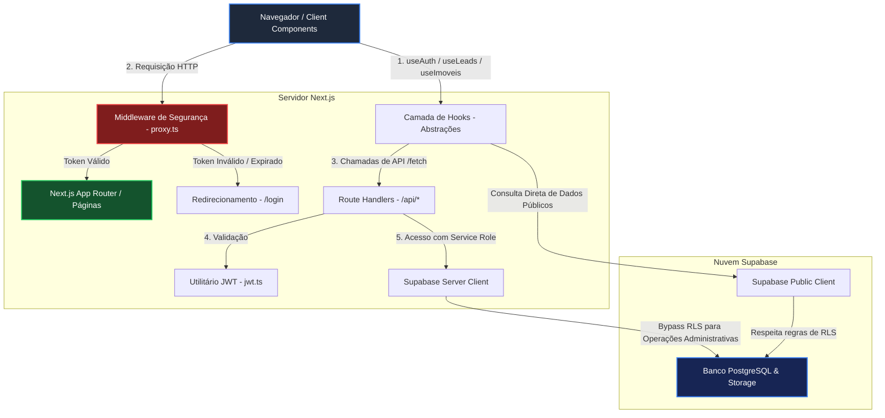

# CorreIA — CRM Imobiliário Inteligente
## 🏛️ Documentação de Arquitetura e Engenharia de Software

Este documento apresenta a arquitetura de sistemas, as decisões de design e a aplicação prática de padrões e princípios de engenharia de software no **CorreIA**, um CRM Imobiliário Inteligente desenvolvido com foco em performance, segurança e usabilidade premium.

Este repositório está configurado para a branch de homologação/preview (`preview`) e reflete o estado consolidado da aplicação.

---

## 💻 Visão Geral da Stack Tecnológica

O sistema foi concebido sob uma arquitetura moderna baseada em **BaaS (Backend as a Service)** combinada com rotas de API customizadas (**BFF - Backend For Frontend**) no Next.js para controle refinado de lógica de negócios e segurança.

| Componente | Tecnologia | Versão | Papel no Sistema |
|---|---|---|---|
| **Framework Base** | Next.js (App Router) | `16.2.6` | SSR (Server-Side Rendering), Roteamento e API Routes |
| **Biblioteca UI** | React | `19.2.4` | Gerenciamento de estado reativo e componentes |
| **Estilização** | Tailwind CSS | `4.x` | Design System utilitário e responsividade |
| **Animações** | GSAP (GreenSock) & Motion | `3.x` / `12.x` | Micro-interações, efeitos de rolagem e transições fluidas |
| **Banco de Dados** | Supabase (PostgreSQL) | Serverless | Persistência relacional de dados, Storage e RLS |
| **Autenticação** | JWT Customizado | `jsonwebtoken` | Autenticação stateless persistida via Cookies Seguros |

---

## 👥 Estrutura de Módulos e Responsabilidades da Equipe

Para fins de avaliação de arquitetura, o projeto foi subdividido em módulos funcionais sob a responsabilidade dos respectivos desenvolvedores:

1. **Autenticação JWT Própria e Infraestrutura Base (Breno)**
   - Login e cadastro próprios, sem dependência de serviços externos para sessão.
   - Tokens JWT assinados no servidor e salvos em cookies `httpOnly; Secure; SameSite=Strict`, garantindo imunidade contra ataques XSS.
   - Criptografia de senhas com `bcrypt` no servidor e middleware de proteção de rotas server-side (`src/proxy.ts`).
   - **Melhoria - Redirecionamento de Logout (Item 3º):** Redirecionamento imediato para a Landing Page pública (`/`) ao deslogar da conta, limpando a sessão.

2. **CRM / Módulo de Leads & Funil Kanban (Giuseppe)**
   - Gestão completa de Leads (criação, edição, exclusão e detalhamento).
   - Quadro Kanban interativo com 5 colunas representando as etapas do funil de vendas (`Novo` → `Em atendimento` → `Visita agendada` → `Proposta` → `Fechado`).
   - Mapeamento robusto entre as propriedades em formato camelCase no cliente e snake_case no banco de dados.
   - **Melhoria - Atribuição Automática de Leads (Item 1º):** Os leads preenchidos no formulário da Landing Page são atribuídos diretamente ao primeiro corretor ativo disponível no sistema.
   - **Melhoria - Extração Inteligente via IA (Item 2º):** Processamento da conversa do assistente virtual utilizando o Gemini em tempo real para extrair nome, e-mail e telefone de contato do cliente, salvando os dados como lead associado no banco.
   - **Melhoria - Painel do Lead com Chat e Portfólio (Item 4º):** Dashboard exclusivo do lead estruturado com catálogo de imóveis disponíveis e assistente virtual interativo integrados em abas.

3. **Catálogo de Imóveis (Gabriel Brandão)**
   - CRUD completo de imóveis (Casa, Apartamento, Terreno, Comercial).
   - Integração com o **Supabase Storage** para upload de fotos do imóvel direto do formulário de criação/edição.
   - Controle de status de disponibilidade do imóvel (`Disponível`, `Vendido`, `Alugado`).
   - **Melhoria - Adaptação de Privilégios para Leads (Item 4º):** Restrição na visualização de detalhes de imóveis para ocultar botões de edição e exclusão caso o perfil seja do tipo `lead`, adaptando a navegação para o dashboard.

4. **Visual Premium & Landing Page (Gustavo Gurgel)**
   - Identidade visual moderna baseada em Dark Mode e Glassmorphism.
   - Landing page com Seção Hero dinâmica e um **Cinematic Footer** interativo equipado com **GSAP** e **ScrollTrigger**, incluindo efeitos magnéticos e animações guiadas pelo rolamento da página.

---

## 📐 Arquitetura de Sistemas e Fluxo de Dados

A arquitetura do CorreIA é estruturada em camadas bem definidas para garantir o desacoplamento entre a interface do usuário (UI), a lógica de negócios e os serviços de infraestrutura de dados.

### Diagrama de Fluxo de Execução e Autenticação



---

## ⚡ Aplicação Prática dos Princípios SOLID

O desenvolvimento do CorreIA baseou-se rigorosamente nos princípios **SOLID** para assegurar a manutenibilidade, extensibilidade e testabilidade do sistema a longo prazo. Abaixo está detalhado como cada princípio foi mapeado no código-fonte.

### 1. **S**ingle Responsibility Principle (Princípio da Responsabilidade Única)
> *Um módulo, classe ou função deve ter apenas uma, e somente uma, razão para mudar.*

No CorreIA, evitamos "super-arquivos" ou componentes monolíticos que acumulam lógica visual, chamadas de rede e tratamento de dados.
- **[jwt.ts](file:///Users/a1234/CorreiAi-web-/src/lib/jwt.ts):** Tem a única e exclusiva responsabilidade de codificar (`signToken`) e decodificar (`verifyToken`) os tokens JWT, sem saber como eles são armazenados ou em quais rotas são aplicados.
- **[leads-mapper.ts](file:///Users/a1234/CorreiAi-web-/src/lib/leads-mapper.ts):** Dedica-se unicamente a traduzir o modelo relacional de banco de dados (colunas em `snake_case` originárias do Supabase) para a tipagem segura do front-end (propriedades em `camelCase`), isolando essa transformação da lógica de renderização ou de requisições de rede.
- **[proxy.ts](file:///Users/a1234/CorreiAi-web-/src/proxy.ts):** Atua estritamente como um interceptor HTTP server-side no Next.js. Sua única função é inspecionar o cookie de sessão e autorizar ou redirecionar o tráfego, mantendo as páginas e controllers completamente alheios ao fluxo de validação de rotas.

### 2. **O**pen/Closed Principle (Princípio do Aberto/Fechado)
> *Entidades de software devem estar abertas para extensão, mas fechadas para modificação.*

O sistema foi arquitetado para permitir novas features e regras de negócio sem a necessidade de reescrever lógica estrutural existente.
- **Estrutura de Tipagem e Configuração do Funil ([lead.ts](file:///Users/a1234/CorreiAi-web-/src/types/lead.ts)):** As etapas do funil Kanban (`ETAPAS_FUNIL`) e categorias de imóveis (`TIPOS_IMOVEL`) são definidas como arrays constantes tipados (`as const`). Se a imobiliária expandir e necessitar de uma nova etapa (ex: "Análise de Crédito"), basta adicionar o novo nó na constante de configuração. O mecanismo de renderização do `KanbanBoard` e os validadores de API absorvem a mudança automaticamente, sem requerer modificações em seus códigos internos.
- **Roteamento Plugável do Next.js:** A estrutura de diretórios do App Router permite que novas páginas e rotas de API sejam acopladas ao sistema simplesmente criando novas pastas (ex: `/imoveis/novo`), sem alterar um arquivo mestre de configuração de rotas globais.

### 3. **L**iskov Substitution Principle (Princípio da Substituição de Liskov)
> *Objetos de uma superclasse devem ser substituíveis por objetos de suas subclasses sem afetar a corretude do programa.*

A aplicação utiliza a modelagem de perfis polimórficos de maneira coerente no ecossistema TypeScript e PostgreSQL:
- **Polimorfismo de Perfis ([jwt.ts](file:///Users/a1234/CorreiAi-web-/src/lib/jwt.ts) & [AuthContext.tsx](file:///Users/a1234/CorreiAi-web-/src/contexts/AuthContext.tsx)):** A entidade de usuário logado é representada pela interface `JwtPayload` e pelo tipo `role` (`'corretor' | 'lead' | 'admin_corretora' | 'super_admin'`). Toda a infraestrutura de segurança, hooks e contextos consome o payload autenticado de forma genérica. As especializações de comportamento (ex: renderizar ferramentas de corretor ou visualização simples de cliente no Dashboard) ocorrem de maneira transparente sem violar o contrato esperado do objeto de perfil.

### 4. **I**nterface Segregation Principle (Princípio da Segregação de Interfaces)
> *Clientes não devem ser forçados a depender de interfaces que não utilizam.*

Evitamos interfaces genéricas que obrigam componentes a carregar dados desnecessários ou obsoletos.
- **Segregação de Contratos de Lead ([lead.ts](file:///Users/a1234/CorreiAi-web-/src/types/lead.ts)):** Dividimos as entidades em interfaces granulares:
  - `Lead`: Objeto completo contendo metadados gerados pelo servidor (`id`, `criadoEm`, `atualizadoEm`). Usado por cards de exibição de dados.
  - `LeadInput`: Interface reduzida contendo apenas os dados editáveis (nome, telefone, orçamento, etc.). Usada por formulários de criação e edição, evitando que o front-end precise simular ou preencher dados de controle do banco de dados na criação.
- **Props de Componentes do Kanban:** O componente `KanbanColuna` recebe estritamente a lista filtrada de leads a serem desenhados nela (`leads: Lead[]`) e um callback de movimentação. Ele não tem acesso e nem depende de funções globais de exclusão, edição ou outros fluxos fora de seu escopo visual.

### 5. **D**ependency Inversion Principle (Princípio da Inversão de Dependência)
> *Módulos de alto nível não devem depender de módulos de baixo nível. Ambos devem depender de abstrações.*

A UI do sistema nunca se comunica diretamente com drivers de persistência ou chamadas imperativas brutas.
- **Abstração por meio de Hooks Customizados ([useImoveis.ts](file:///Users/a1234/CorreiAi-web-/src/hooks/useImoveis.ts) e [useLeads.ts](file:///Users/a1234/CorreiAi-web-/src/hooks/useLeads.ts)):** Componentes como `ImoveisPage` ou `KanbanBoard` dependem de abstrações (hooks) para obter e manipular dados. Eles não sabem se os dados vêm do Supabase localmente, de uma API externa REST ou de memória cache. Se no futuro o banco de dados for alterado de Supabase para uma API GraphQL própria, a camada de visualização (UI) permanecerá 100% intacta; apenas o corpo interno dos hooks precisará ser modificado.
- **Abstração do Provedor de Autenticação ([AuthContext.tsx](file:///Users/a1234/CorreiAi-web-/src/contexts/AuthContext.tsx)):** Os componentes dependem do hook `useAuth()` (uma abstração baseada em contexto React) em vez de acoplarem-se diretamente às rotas de login/logout ou ao SDK do banco de dados. De fato, a migração do Firebase Auth para o sistema JWT próprio foi realizada alterando apenas o escopo interno do `AuthContext`, sem provocar qualquer quebra de contrato ou alteração nas interfaces gráficas do Dashboard, Login ou Cadastro.

---

## 📦 Detalhamento dos Módulos e Recursos Implementados

O projeto foi dividido em frentes funcionais para garantir entregas incrementais consistentes:

### 1. Autenticação Stateless via JWT Próprio
- **Objetivo:** Substituir serviços externos de terceiros (como Firebase Auth), reduzindo acoplamento tecnológico e custos.
- **Armazenamento Seguro:** O token gerado no servidor é injetado no navegador via cookie `httpOnly`, com as flags `Secure` (exige HTTPS) e `SameSite=Strict` (proteção contra ataques CSRF). Isso impede o acesso ao token por scripts maliciosos no cliente (mitigação completa de ataques XSS).
- **Criptografia:** Senhas recebem hashing server-side utilizando `bcryptjs` com custo computacional (salt rounds) ajustado para 12.
- **Middleware de Intercepção ([proxy.ts](file:///Users/a1234/CorreiAi-web-/src/proxy.ts)):** Next.js executa a verificação criptográfica do token a cada requisição de página segura antes que qualquer Javascript ou HTML seja enviado ao cliente, bloqueando acessos indevidos com tempo de resposta quase instantâneo.

### 2. CRM & Kanban Dinâmico de Leads
- **Painel Kanban (/funil):** Representação visual do funil de vendas organizado em 5 colunas reativas (`Novo`, `Em atendimento`, `Visita agendada`, `Proposta`, `Fechado`).
- **Drag-and-Drop:** Interatividade com arrastar e soltar de leads entre colunas com sincronização em tempo real via chamadas HTTP `PATCH /api/leads/[id]` para persistência direta no Supabase.
- **Mapeador Bidirecional:** O tradutor `leads-mapper.ts` garante a consistência das propriedades em formato camelCase no cliente e snake_case no banco de dados.

### 3. Catálogo de Imóveis (CRUD com Upload)
- **Painel de Controle (/imoveis):** Gerenciamento completo de ativos imobiliários (Casa, Apartamento, Terreno, Comercial).
- **Upload de Imagens:** Integração do formulário com o **Supabase Storage** (bucket público `imoveis_imagens`). O upload envia o arquivo binário diretamente para a nuvem e salva a URL pública no registro do imóvel.
- **Controle de Disponibilidade:** Exposição clara do status do imóvel (`Disponível`, `Vendido`, `Alugado`) atualizando dinamicamente os cards visuais.

### 4. Interface Cinematográfica & Experiência de Uso Premium
- **Landing Page (/):** Design escuro refinado baseado em Glassmorphism, tipografia humanista e vídeo Hero otimizado em HLS (HTTP Live Streaming) utilizando a biblioteca `hls.js`.
- **Animações Fluidas:** Utilização do ecossistema **GSAP (GreenSock)** com **ScrollTrigger** no `CinematicFooter` para gerar efeitos tridimensionais, botões magnéticos interativos que seguem o cursor e textos que se revelam conforme o rolamento da página.

---

## 🗂️ Estrutura Arquitetural do Projeto

```text
src/
├── app/
│   ├── api/                           # Camada BFF - Route Handlers da API
│   │   ├── auth/
│   │   │   ├── login/route.ts         # POST — valida credenciais, assina e injeta JWT
│   │   │   ├── register/route.ts      # POST — cria corretor com hash bcrypt e emite cookie
│   │   │   ├── logout/route.ts        # POST — expira o cookie de autenticação
│   │   │   └── me/route.ts            # GET  — decodifica JWT e lê perfil no banco
│   │   └── leads/
│   │       ├── route.ts               # GET/POST — listagem e criação de leads
│   │       ├── [id]/route.ts          # GET/PATCH/DELETE — operações individuais de leads
│   │       └── public/route.ts        # POST — captura pública de leads (Landing Page)
│   ├── cadastro/                      # Rota de Cadastro de corretores
│   │   └── page.tsx
│   ├── dashboard/                     # Painel administrativo adaptável por cargo
│   │   └── page.tsx
│   ├── funil/                         # Rota do Funil de vendas (Kanban Board)
│   │   └── page.tsx
│   ├── imoveis/                       # Catálogo e CRUD de Imóveis
│   │   ├── page.tsx                   # Listagem de Imóveis
│   │   ├── novo/page.tsx              # Formulário de criação
│   │   └── [id]/
│   │       ├── page.tsx               # Detalhes do imóvel
│   │       └── editar/page.tsx        # Formulário de edição
│   ├── leads/                         # Listagem clássica e detalhes de leads
│   │   ├── page.tsx
│   │   └── [id]/page.tsx
│   ├── login/                         # Rota de login de usuários
│   │   └── page.tsx
│   ├── globals.css                    # Tokens de marca, CSS global e Tailwind 4
│   ├── layout.tsx                     # Layout global (Navbar, AuthProvider)
│   └── page.tsx                       # Landing Page / Entrada principal
├── components/                        # Componentes visuais encapsulados
│   ├── Navbar.tsx                     # Menu global adaptável ao perfil autenticado
│   ├── ProtectedRoute.tsx             # Proteção client-side (exibição de loaders)
│   ├── ConfirmModal.tsx               # Modal genérico de confirmação para ações destrutivas
│   ├── ImovelCard.tsx                 # Card de listagem do imóvel
│   ├── ImovelForm.tsx                 # Form unificado (Novo/Edição) com upload de fotos
│   ├── auth/
│   │   └── BackToHomeButton.tsx       # Componente de navegação de retorno
│   ├── cadastro/
│   │   └── CadastroForm.tsx           # Formulário padronizado de cadastro
│   ├── landing/                       # Componentes exclusivos da Landing Page
│   │   ├── LandingNavbar.tsx
│   │   ├── HeroSection.tsx            # Hero com player de vídeo HLS e formulário rápido
│   │   ├── LeadCaptureForm.tsx        # Captura de lead direto na landing
│   │   ├── LandingMidShowcase.tsx     # Grid com fotos de imóveis via Unsplash
│   │   ├── CinematicFooter.tsx        # Rodapé animado com GSAP
│   │   └── SunburstIcon.tsx           # Vetorial dinâmico de marca
│   └── leads/                         # Componentes do ecossistema de CRM
│       ├── ConfirmDialog.tsx
│       ├── KanbanBoard.tsx            # Kanban Board (Orquestrador)
│       ├── KanbanColuna.tsx           # Coluna do funil
│       ├── LeadCard.tsx               # Card arrastável do lead
│       └── LeadForm.tsx               # Form de cadastro/edição de lead
├── contexts/
│   └── AuthContext.tsx                # Provedor global de estado de autenticação
├── hooks/                             # Custom React Hooks (Camada de Abstração de Dados)
│   ├── useAuth.ts                     # Consumo rápido do contexto de autenticação
│   ├── useImoveis.ts                  # Métodos CRUD e upload de fotos de imóveis
│   └── useLeads.ts                    # Métodos de busca e atualização de leads
├── lib/                               # Utilitários e Clientes de Infraestrutura
│   ├── api-auth.ts                    # Extração e validação rápida do token em rotas de API
│   ├── jwt.ts                         # Biblioteca de manipulação de tokens JWT
│   ├── leads-mapper.ts                # Mapeador de schemas (Database <-> Front-end)
│   ├── leads.ts                       # Métodos HTTP clientes para leads
│   └── supabase.ts                    # Fábrica de conexões Supabase (Anon/Service Role)
├── types/
│   └── lead.ts                        # Definições estáticas de tipos e contratos do CRM
└── proxy.ts                           # Middleware global de autenticação server-side
```

---

## 🗄️ Modelagem Física do Banco de Dados (SQL DDL)

Para inicializar a estrutura relacional no Supabase, os seguintes comandos SQL devem ser executados no **SQL Editor**:

```sql
-- 1. Tabela de Perfis de Usuários (Corretores e Clientes)
CREATE TABLE perfis (
  id            uuid PRIMARY KEY DEFAULT gen_random_uuid(),
  nome_completo text NOT NULL,
  email         text UNIQUE NOT NULL,
  cpf           text,
  creci         text,
  senha_hash    text NOT NULL,
  role          text DEFAULT 'corretor', -- Níveis de permissão: 'corretor' | 'lead' | 'admin_corretora' | 'super_admin'
  criado_em     timestamp with time zone DEFAULT timezone('utc', now()) NOT NULL
);

-- Desativação de RLS temporária para fins de homologação acadêmica
ALTER TABLE perfis DISABLE ROW LEVEL SECURITY;

-- 2. Tabela de Leads (Gerenciados pelo CRM)
CREATE TABLE leads (
  id              uuid PRIMARY KEY DEFAULT gen_random_uuid(),
  nome            text NOT NULL,
  telefone        text NOT NULL,
  email           text NOT NULL,
  faixa_orcamento text NOT NULL,
  tipo_imovel     text NOT NULL,
  etapa           text NOT NULL DEFAULT 'novo',
  corretor_id     uuid REFERENCES perfis(id) ON DELETE SET NULL,
  criado_em       timestamptz DEFAULT timezone('utc', now()) NOT NULL,
  atualizado_em   timestamptz DEFAULT timezone('utc', now()) NOT NULL
);

ALTER TABLE leads DISABLE ROW LEVEL SECURITY;

-- 3. Tabela de Imóveis (Catálogo Comercial)
CREATE TABLE imoveis (
  id          uuid PRIMARY KEY DEFAULT gen_random_uuid(),
  tipo        text NOT NULL, -- 'casa' | 'apartamento' | 'terreno' | 'comercial'
  endereco    text NOT NULL,
  bairro      text NOT NULL,
  valor       numeric NOT NULL,
  metragem    numeric,
  quartos     integer,
  vagas       integer,
  status      text NOT NULL DEFAULT 'disponivel', -- 'disponivel' | 'vendido' | 'alugado'
  imagem_url  text,
  criado_em   timestamp with time zone DEFAULT timezone('utc', now()) NOT NULL
);

ALTER TABLE imoveis DISABLE ROW LEVEL SECURITY;
```

> **Configuração do Supabase Storage:**
> O upload de fotos dos imóveis requer a criação de um bucket público nomeado **`imoveis_imagens`** no painel de Storage do Supabase. A configuração como **Public** é essencial para permitir que o navegador renderize as URLs geradas nos cards dos imóveis.

---

## ⚙️ Variáveis de Ambiente e Configuração Local

Para executar o projeto localmente, crie um arquivo `.env.local` na raiz do projeto contendo as credenciais de homologação:

```env
# JWT — Mantenha estritamente privado (sem NEXT_PUBLIC_)
JWT_SECRET=gerar_uma_hash_segura_openssl_ou_texto

# Supabase Service Role — Chave administrativa privada para API Routes (sem NEXT_PUBLIC_)
SUPABASE_SERVICE_ROLE_KEY=sua_chave_service_role_aqui

# Supabase Públicos — Utilizados pelo cliente no navegador
NEXT_PUBLIC_SUPABASE_URL=https://seu_projeto_id.supabase.co
NEXT_PUBLIC_SUPABASE_ANON_KEY=sua_chave_anonima_publica_aqui
```

---

## 🚀 Instruções de Execução

### Instalação de Dependências
```bash
pnpm install
```

### Modo de Desenvolvimento
Inicia o servidor hot-reload local em [http://localhost:3000](http://localhost:3000):
```bash
pnpm dev
```

### Compilação de Produção
Compila o projeto Next.js realizando a checagem estática de tipos do TypeScript e gerando a pasta de otimização `.next`:
```bash
pnpm build
```

### Executar Build de Produção
```bash
pnpm start
```
